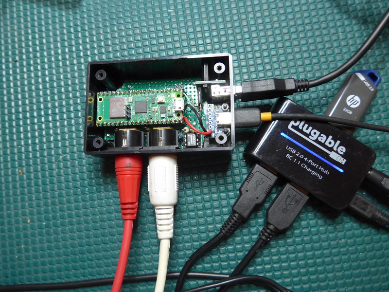
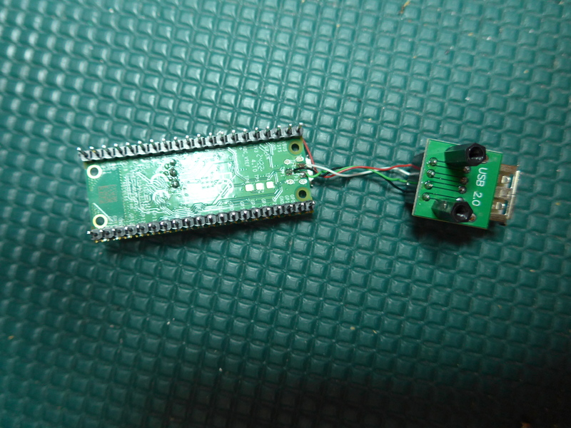
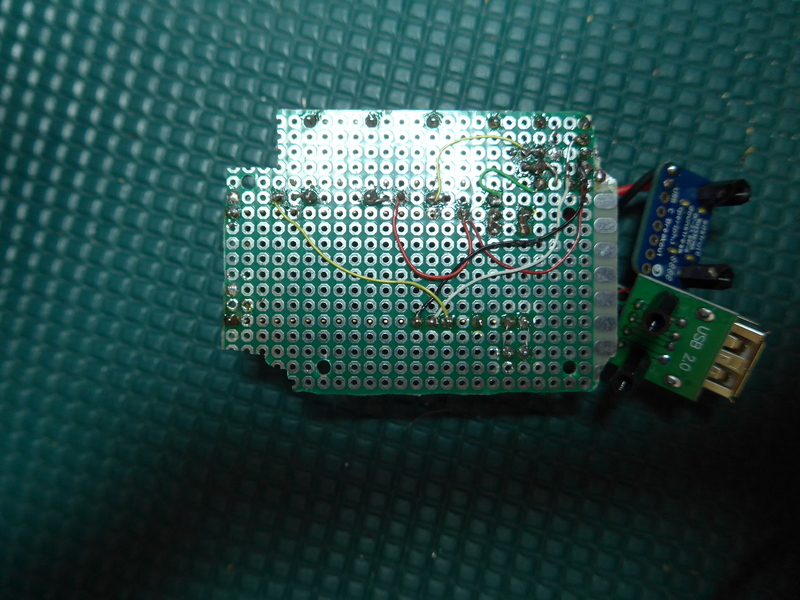

# midi2usbhub
Use a Raspberry Pi Pico to interconnect MIDI devices via a USB hub or old school MIDI.

This project uses a Pico board, a micro USB to USB A adapter, and a powered USB hub
to run software that routes MIDI data among all the devices connected to the hub.
There is a UART DIN MIDI IN and a UART DIN MIDI OUT, so you can connect
to old school MIDI too. You can route the UART MIDI the same way your route USB MIDI.
You configure the routing with command line interpreter (CLI) commands through
a serial port terminal.

The software uses some of the Pico board's program flash for a file system
to store configurations in presets. If you save your settings to a preset, then
the midi2usbhub software will automatically reload the last saved preset on startup
and when you plug a Connected MIDI Device to the hub. You can back up any or all of
your presets to a USB Flash drive connected to the USB hub. Presets are stored in
JSON format.

# Project Status
### 17-Aug-2023
- Updated the project to use the master branch of TinyUSB and `lib/usb_midi_host` as an application USB Host driver.
- Removed references to patching the TinyUSB library; it is no longer required.
### 16-Dec-2022
- Separated the CLI from the Midi2usbhub class and from the Preset_manager class.
- Preset_manager class is no longer a singleton but instead a member of Midi2usbhub class
### 1-Dec-2022
- Added support for Pico-W board LED
- Added hardware description
- Still need to review code comments and internal documentation, clean up
formatting, etc.

### 24-Nov-2022
- All features implemented except future features
- Need to clean up code and documentation and fix issues.
- Need to document the hardware.
- I have seen an assert that happens sometimes at startup with many devices plugged
to the hub. Need to figure that one out especially because it causes a crash.

### 22-Nov-2022
You can now save and load setups using Pico program flash storage. The last preset
save or loaded will be remembered on startup or when a device is plugged or unplugged.
Expanded the command set to allow for LittleFs management. Still need to implement
backup and restore.

### 20-Nov-2022
Very early public release to help with USB MIDI host hub testing. Definitely not done.
May crash from time to time when you plug in a new device. I have not investigated that
yet. Not easily repeatable. UART MIDI is also implemented.

## Future Features
- Implement on a Pico-W with embedded web server support so you don't need to use
the CLI.

# Hardware
If you already built [midi2usbhost](https://github.com/rppicomidi/midi2usbhost) hardware,
you can use that again for this project. As of this writing, it is the same: you need
a USB host connector, a source for 5V power, a MIDI IN port, and a MIDI OUT port. You just
need to plug a powered USB hub to the USB host port. The only difference is that this
project has a CLI user interface through the pins for UART1.

If you build your own MIDI hardware, please test it carefully before you plug it into
an expensive musical instrument.

For this project, I am showing a more finished project. I built it with a Pico-W board because I want to eventually control it via a browser instead of, or perhap in addition
to, the CLI. The enclosure is a [Bud CU-1941](https://www.budind.com/wp-content/uploads/2019/01/hbcu1941.pdf) with the insides smoothed out and holes
cut for the connectors. Smoothing away the PCB card guides was a pain. I would use
something else of similar dimensions if I were doing it over again.
The USB breakout boards mount on M2 standoffs, and the
main board attaches to the box with M2 screws with M2 nuts serving as standoffs.
. 

I wired a generic USB A breakout board directly to the Pico's testpoints for GND,
D+ and D-; the 5V VBus comes from Pico board pin 40:


The Pico-W board plugs to hand-wired board that holds the MIDI IN, the MIDI OUT, and
the 5V power connector. I hacked up a 5cm x 7cm board so it would fit in my project box.


Bottom view:


The Pico board gets 5V and GND from the VBus and GND pins of a USB C breakout board.
I used the 3.3V MIDI IN circuit from [here](https://diyelectromusic.wordpress.com/2021/02/15/midi-in-for-3-3v-microcontrollers/) and I followed the
[MIDI Specification](https://www.midi.org/specifications/midi-transports-specifications/5-pin-din-electrical-specs) for 3.3V MIDI OUT. I admit to cheating by using 1/4W 33 ohm
resistor; I didn't have a 1/2W resistor on hand. Hopefully that MIDI OUT pin never gets
shorted to ground for very long because it will fry the resistor. I substituted a Sharp
PC900V for the MIDI IN circuit's H11L1M because it was what I had.

# Setting Up Your Build and Debug Environment
I am running Ubuntu Linux 22.04LTS on an old PC. I have Visual Studio Code (VS Code)
installed and went
through the tutorial in Chapter 7 or [Getting started with Raspberry Pi Pico](https://datasheets.raspberrypi.com/pico/getting-started-with-pico.pdf) to make sure it was working
first. I use a picoprobe for debugging, so I have openocd running in a terminal window.
I use minicom for the serial port terminal (make sure your linux account is in the dialup
group).

## Use a TinyUSB library version that supports application host drivers
The USB MIDI host driver is currently not part of the TinyUSB stack. It is an
application host driver found in this project's `lib/usb_midi_host` directory.
The Pico SDK uses the main repository for TinyUSB as a git submodule. The version
of TinyUSB that ships with the Pico SDK 1.5.1 does not support application host
drivers. That feature was added 15-Aug-2023. You will likely need the latest version
of the TinyUSB library for this code to work correctly. The following describes
how to make sure your Pico SDK version's TinyUSB library supports application host
drivers.

1. If you have not already done so, follow the instructions for installing the Raspberry Pi Pico SDK in Chapter 2 of the 
[Getting started with Raspberry Pi Pico](https://datasheets.raspberrypi.com/pico/getting-started-with-pico.pdf)
document. In particular, make sure `PICO_SDK_PATH` is set to the directory where you installed the pico-sdk.
2. Set the working directory to the tinyusb library and make sure you are on the main branch.
```
cd ${PICO_SDK_PATH}/lib/tinyusb
git checkout master
```
3. Check the date on the last commit to the TinyUSB library master branch.
```
git log -1
```
4. If the `Date:` is >= 15-Aug-2023, your TinyUSB library should be fine. If not, get the latest
```
git pull
```

## Get the project code
Clone the midiusb2hub project to a directory at the same level as the pico-sdk directory.

```
cd ${PICO_SDK_PATH}/..
git clone --recurse-submodules https://github.com/rppicomidi/midi2usbhub.git
```

## Command Line Build (skip if you want to use Visual Studio Code)

Enter this series of commands (assumes you installed the pico-sdk
and the midid2usbhub project in the ${PICO_MIDI_PROJECTS} directory)

If your system is based on a Pico W board, enter this command first
```
export PICO_BOARD=pico_w
```
For all boards, enter this commands.

```
export PICO_SDK_PATH=${PICO_MIDI_PROJECTS}/pico-sdk/
cd ${PICO_MIDI_PROJECTS}/midi2usbhub
mkdir build
cd build
cmake ..
make
```
The build should complete with no errors. The build output is in the build directory you created in the steps above.

# Troubleshooting
If your project works for some USB MIDI devices and not others, one
thing to check is the size of buffer to hold USB descriptors and other
data used for USB enumeration. Look in the file `tusb_config.h` for
```
#define CFG_TUH_ENUMERATION_BUFSIZE 512
```
Very complex MIDI devices or USB Audio+MIDI devices like DSP guitar pedals
or MIDI workstation keyboards may have large USB configuration descriptors.
This project assumes 512 bytes is enough, but it may not be for your device.

To check if the descriptor size is the issue, use your development computer to
dump the USB descriptor for your device and then add up the wTotalLength field
values for each configuration in the descriptor.


For Linux and MacOS Homebrew, the command is lsusb -d [vid]:[pid] -v
For Windows, it is simplest to install a program like
[Thesycon USB Descriptor Dumper](https://www.thesycon.de/eng/usb_descriptordumper.shtml).

For example, this is the important information from `lsusb -d 0944:0117 -v`
from a Korg nanoKONTROL2:
```
  bNumConfigurations      1
  Configuration Descriptor:
    bLength                 9
    bDescriptorType         2
    wTotalLength       0x0053
    bNumInterfaces          1
    bConfigurationValue     1
    iConfiguration          0 
    bmAttributes         0x80
      (Bus Powered)
    MaxPower              100mA
```
This is the important information from the Thesycon USB Descriptor Dumper for
a Valeton NUX MG-400
```
0x01	bNumConfigurations

Device Qualifier Descriptor is not available. Error code: 0x0000001F


-------------------------
Configuration Descriptor:
-------------------------
0x09	bLength
0x02	bDescriptorType
0x0158	wTotalLength   (344 bytes)
0x04	bNumInterfaces
0x01	bConfigurationValue
0x00	iConfiguration
0xC0	bmAttributes   (Self-powered Device)
0x00	bMaxPower      (0 mA)
```
You can see that if `CFG_TUH_ENUMERATION_BUFSIZE` were 256 instead of 512,
the Korg nanoKONTROL2 would have no trouble enumerating but the Valeton
NUX MG-400 would fail because TinyUSB couldn't load the whole configuration
descriptor to memory.

# Terms this document uses
- **Connected MIDI Device**: a MIDI device connected to a USB hub port or to a serial
port MIDI DIN connector.
- **USB ID**: A pair of numbers the Connected MIDI Device reports to the
hub when it connects. They are supposed to be unique to a particular
product.
- **Routing Matrix**: The software that sends MIDI data to and from Connected MIDI Devices
- **Terminal**: a MIDI data input to or output from the Routing Matrix.
- **FROM terminal**: an input to the Routing Matrix. It will be a MIDI OUT signal from
a Connected MIDI Device.
- **TO terminal**: an output from the Routing Matrix. It will be a MIDI IN signal to
a Connected MIDI Device.
- **Port**: usually a group of 1 MIDI IN data stream and one MIDI OUT data stream associated with a Connected MIDI Device. A Port of a Connected MIDI Device may omit MIDI IN or MIDI OUT, but not both. Ports are numbered 1-16
- **Direction** of a terminal: either FROM the Connected MIDI Device's MIDI OUT
or TO the Connected MIDI Device's MIDI IN.
- **Nickname**: a more human name than specifying a device port's FROM and TO
data streams using a USB ID, a Port number and a Direction. Nicknames have
a maximum of 12 characters. The default nickname for a port in a given
direction is the USB ID followed by either a "F" for a FROM data stream or
"T" for a TO data stream, followed by the port number (1-16). For example,
"Drumpads" above was renamed from "0000-0000-F1"
- **Product Name**: a name that identifies the the attached MIDI
device. The Connected MIDI Device sends it to the hub on connection; it is a more friendly
name than USB ID, and is the easiest way to assocate the Connected MIDI Device
with all the other info.

# Command Line Commands
## help
Show a list of all available commands and brief help text.

## list
List all Connected MIDI Devices currently connected to the USB hub. For example:

```
USB ID      Port  Direction Nickname    Product Name
0000-0000    1      FROM    Drumpads    MIDI IN A
0000-0000    1       TO     TR-707      MIDI OUT A
0499-1622    1      FROM    lead-out    reface CS
0499-1622    1       TO     lead        reface CS
1C75-02CA    1      FROM    keys        Arturia Keylab Essential 88
1C75-02CA    1       TO     keys-in     Arturia Keylab Essential 88
1C75-02CA    2      FROM    faders      Arturia Keylab Essential 88
1C75-02CA    2       TO     faders-in   Arturia Keylab Essential 88
```

## rename \<Old Nickname\> \<New Nickname\>
Rename the nickname for a product's port. All nicknames must be unique. If you need to
hook up more than one device with the same USB ID, then you must do so one at a
time and change the nickname for each port before attaching the next one to the hub.

## connect \<From Nickname\> \<To Nickname\>
Send data from the MIDI Out port of the MIDI device with nickname \<From Nickname\> to the
MIDI IN port of the device with nickname \<To Nickname\>. If more than one device connects
to the TO terminal of a particular device, then the streams are merged.

## disconnect \<From Nickname\> \<To Nickname\>
Break a connection previously made using the `connect` command.

## reset
Disconnect all routings.

## show
Show a connection matrix of all MIDI devices connected to the hub. A blank box means "not
connected" and an `x` in the box means "connected." For example, the following shows
MIDI OUT of the "keys" device connected to the MIDI IN of the "lead" device.

```
       TO-> |   |   |   |
            |   |   |   |
            |   |   |   |
            |   |   | f |
            |   |   | a |
            | l | k | d |
            | e | e | e |
FROM |      | a | y | r |
     v      | d | s | s |
            | - | - | - |
            | i | i | i |
            | n | n | n |
------------+---+---+---+
lead        |   |   |   |
------------+---+---+---+
keys        | x |   |   |
------------+---+---+---+
faders      |   |   |   |
------------+---+---+---+
```

## save \<preset name\>
Save the current setup to the given \<preset name\>. If there is already a preset with that
name, then it will be overwritten.

## load \<preset name\>
Load the current setup from the given \<preset name\>. If the preset was not previously
saved using the save command, then print an error message to the console.

## backup [\<preset name\>]
Copy the specified preset to USB flash drive to a file on the drive named `/rppicomidi-midi2usbhub/<preset name>`. If no preset name is given, then all presets are copied to the
flash drive.

## restore \<preset name\>
Copy the specified preset from the USB flash drive directory `/rppicomidi-midi2usbhub/<preset name>` to the file system on Pico board's program flash.

## format
Reformat the LittleFs file system in the Pico's program memory. It delete all presets.

## fsstat
Print information about the LittleFs file system

## ls [path]
List all files in the LittleFs file system. If you specify a `path`, then list the contents
of the `path` directory. For now, the only directory path is `/`.

## rm \<filename\>
Deletes the file with name \<filename\> in the LitteFs file system

## f-cd [path]
Change current directory of the current USB flash drive to `path`. If `path` is not specified,
equivalent to `f-cd /` (i.e., set to the drive root directory).

## f-chdrive \<drive number 0-3\>
Change current drive number for the USB flash drive. Will only need to do this if you have
more than one flash drive plugged in. When you plug in a drive, the code automatically
sets the drive number to the latest drive.

## f-ls [path]
List contents of the current directory on the current USB flash drive if `path` is not
specified. Otherwise, list the contents of the specified path.

## f-pwd
Print the current directory path of the current USB flash drive.

## set-date \<year(2022-9999)\> \<month(1-12)\> \<day(1-31)\>
Change real-time clock date. The date and time is used for external flash drive file timestamps.

## set-time \<hour(0-23)\> \<minute(0-59)\> \<second(0-59)\>
Change the real-time clock time of day.
The date and time is used for external flash drive file timestamps.

## get-datetime
Print the current date and time as read from the on-chip real-time clock. The time
has a resolution of 2 seconds as because that is what is required for flash drive
file timestamps. The initial date and time will be the last time you built the
msc-rp2040rtc library.
